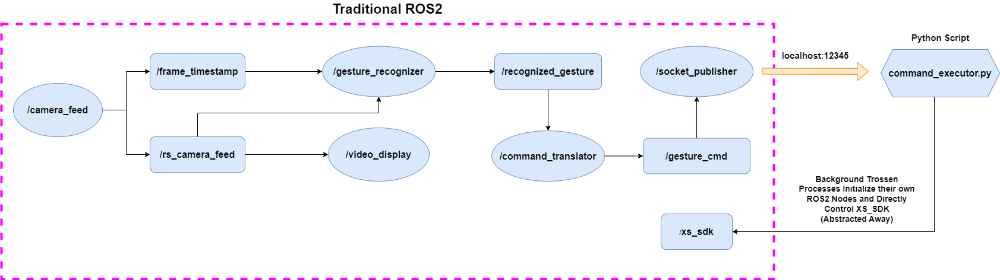

# Robotic Arm Control Via Hand Gesture Recognition

## Description
This is a class project for `CPSC 4910 - CS Applications in Robotics`.
The project implements control of a robotic arm via hand gesture recognition.

## Dependencies
The project was designed to be used with a Trossen Robotics Locobot-WX250s in conjunction with an Intel Realsense D435 RGBD camera.

### Software
- [ROS2 Galactic](https://docs.ros.org/en/galactic/index.html)
- [Trossen Interbotix ROS2 Packages](https://docs.trossenrobotics.com/interbotix_xslocobots_docs/ros2_packages.html)
- [Intel Realsense SDK](https://dev.intelrealsense.com/docs/docs-get-started?_ga=2.43295590.2124744568.1709670869-273457915.1707248308)
- [Google Media Pipe](https://developers.google.com/mediapipe/solutions/vision/gesture_recognizer#configurations_options)
- [Ubuntu 20.04 LTS](https://ubuntu.com/)
- Python3
- C++

### Hardware
- [Locobot-WX250s](https://www.trossenrobotics.com/locobot-wx250.aspx)
- Intel Realsense D435 RGBD camera (Comes with the Locobot)
  
## Installation
See the links under the Software section for instructions on how to install the external dependencies.  
To run the code on this repo simply run `git clone https://github.com/WillemHueffed/SU_Robotics.git` in your desired working directory.

## Running the Program
Running the program is a multistep process. Make sure you have built and sourced the gesture_control_ros workspace as well as source ROS2 itself.
1. run `ros2 launch interbotix_xslocobot_control xslocobot_control.launch.py robot_model:=locobot_wx250s` make sure you have **built** *and* **sourced** the `interbotix_ws`
1. run `ros2 launch launch.py` from the root of the gesture_control_ros workspace
1. run `python3 command_executor.py` from the root of the git workspace
1. run `python3 ee_state_tracker.py` from the root of the git workspace
   
## Software Architecture

The ellipses corrapsond to ROS2 nodes, while the rectangles corraspond to ROS2 topics. Additionally the diamond is a python script running outside of the ROS2 environment. It is is linked into the workflow via a socket.
- `/camera_feed`
    - This node wraps the RealSense Camera SDK and publishes the camera frames and frame timestamps to their respective topics
- `/video_display`
    - This node takes the camera feed and displays it in an OpenCV window
- `/gesture_recognizer`
    - This node takes the camera feed and frame timestamp and uses it to make a gesture classification which is subsequently published on its respective topic
- `/command_translator`
    - This node takes the recognized gesture and converts it to a movement +/-{x,y,z}
- `/socket_publisher`
    - This node takes the movement command and sends it to the Python script controlling the arm via a socket
- `command_executor.py`
    - This script is running the Python API wrapper which controls the robot. Receives commands via a socket. 
- `/xs_sdk`
    - This node controls the servos for the robotic arm. It is accessed by the Python API wrapper in the background. 

### ROS2 Package Overview
- `gesture_interfaces` implements a simple `Pose` message interface
- `gesture_control` implements all nodes seen in the above diagram
    - Except the socket node which is spun by itself (causes issues otherwise - reason unknown)     

## Challenges Faced
- **Networking**: For much of the quarter I was using my phone's hotspot as a LAN because the school's firewall wouldn't allow me to connect. This lead to communication issues between the base and the robotic arm.
- **Trossen's MoveIt Interface**: While this interface is functional (I think) I wasn't able to get it to work. Its pretty complicated and the documenation for it is severely lacking.
- **Python Trossen API**: I tried spinning the API up in a ROS2 node but this lead to runtime errors because ROS was being initialized twice (once manually and once in the background from the API). I tried moving the API to its own
  thread, then its own process, and finally I got it working by running it as a stand alone script and linking it into the rest of the system via a socket
- **Bugged Packages**: The Python API was also bugged for the better part of the quarter so I was just recently able to start using it (in the last week and a half) after Trossen had pushed fixes to their GitHub
  
## Ideas for Future Work
- **Render Landmarks**: Render the hand landmarks in the video display. This will help the user better understand how the model works (and it will look cool)
- **Display EE Coordinates**: Use Tkinter or some other GUI library to display the goal end coordinates so you don't have to stare at a terminal
- **Extend The Model**: The MediaPipe library supports training your own custom gesture recognition models
- **Extend Arm control**: Currently only `x` and `z` translation are supported. Rotation about the base needs implmenting as well as end effector rotation.
  
## Known Issues
- Trying to spinup the `ee_state_tracker.py` node from inside ROS2 will cause the prgraom to stop working as expected.
- The JSON loader in `command_executor.py` will throw an exception and crash the program if the socket buffer has more than one message in it. Need to implement a way to extract first message and dump the rest..

## [Video Demo](https://www.youtube.com/watch?v=qLx2AlBWP-s&ab_channel=WillemHueffed)
